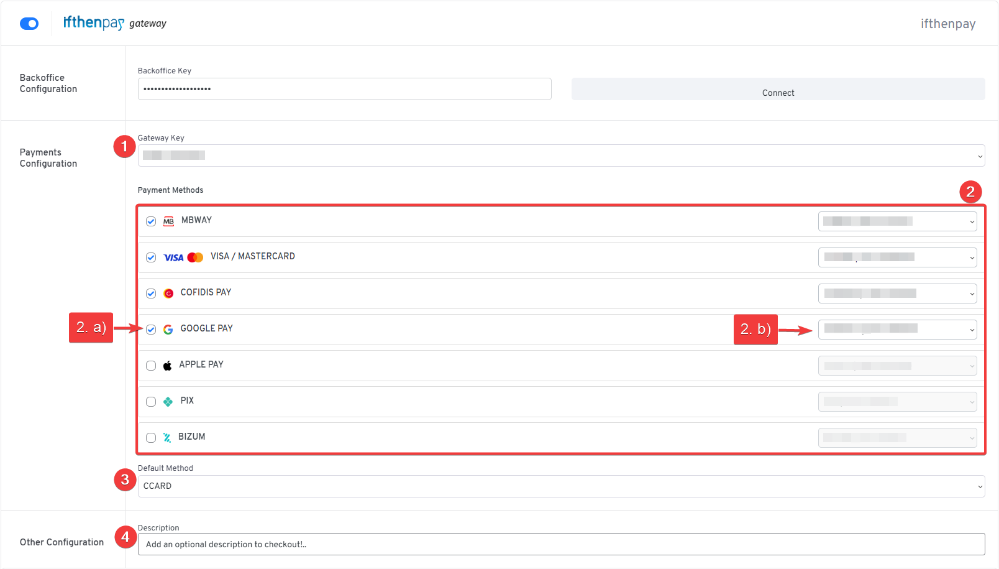
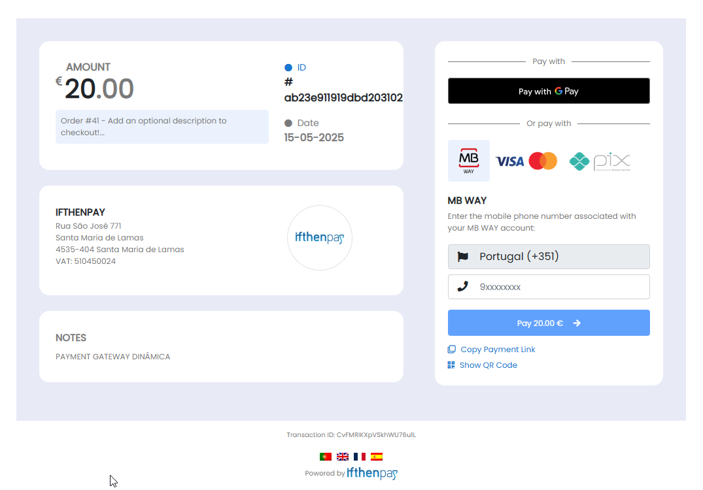
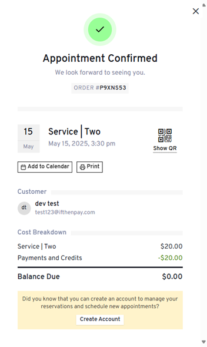

# ifthenpay | Payments for LatePoint

Adds ifthenpay payment methods to LatePoint: cards, wallets, local bank transfers; supports orders and invoices for appointment bookings.

Includes merchant backoffice (basic sales), and secure signed callbacks for automatic payment confirmation.

---

## Table of Contents

- [Description](#description)
- [Key Features](#key-features)
- [Requirements](#requirements)
- [Installation](#installation)
- [Frequently Asked Questions](#frequently-asked-questions)
- [External Services](#external-services)
- [Screenshots](#screenshots)
- [Support](#support)

## Description

This plugin integrates the ifthenpay payment gateway with LatePoint to enable seamless payment processing for appointment bookings. It supports multiple payment methods, including local options like Multibanco and MB WAY, as well as international ones like PIX. Payments are handled via secure pay-by-link, ensuring no sensitive card data is stored on your site. When a customer books an appointment, they can select their preferred payment method, and a secure payment page opens for completion.

### In plain terms you get:

- One-time payments for bookings
- Support for invoices and orders
- Merchant backoffice (basic sales) on web + mobile
- Secure automatic payment confirmations (no card numbers stored)

All settings are made in LatePoint. The plugin is built so store owners can manage payments without needing deep technical knowledge.

## Key Features

1. Easy integration with LatePoint booking flow
2. Invoice payments (Orders & Invoices support)
3. Secure pay-by-link transactions
4. Automatic payment confirmation (fast access)
5. Multiple local payment types (cards, wallets, transfers, vouchers)
6. Merchant backoffice (basic sales & refund reports)
7. Security first (signed callbacks, no card data stored)

## Requirements

- An active ifthenpay merchant account — [subscribe here](https://ifthenpay.com/aderir/) to obtain your credentials.
- A Dynamic Gateway Key (request this from ifthenpay support/helpdesk).
- The payment methods you want enabled on that Gateway Key (our helpdesk team will guide you).
- WordPress 6.5+ and PHP 7.4+, and LatePoint installed and activated.
- HTTPS (SSL) enabled on your site.

## Installation

1. In your WordPress admin, go to **Plugins → Add New** and search for **ifthenpay | Payments for LatePoint**, then click **Install Now**.
2. Or download `ifthenpay-payments-for-latepoint.zip` and upload under **Plugins → Add New → Upload Plugin**.
3. Activate **LatePoint** and **ifthenpay for LatePoint**.
4. Navigate to **LatePoint → Settings → Payments**, enter your ifthenpay Backoffice Key & Gateway Key, and click **Connect**.

## Frequently Asked Questions

<strong>What do I need to get started?</strong>

A valid ifthenpay account (register at https://ifthenpay.com/aderir/), LatePoint plugin active, WordPress 6.5+ and PHP 7.4+.

<strong>How do I configure it?</strong>

1. Go to **LatePoint → Settings → Payments**.  
2. Enable the ifthenpay gateway, enter your Backoffice Key & Gateway Key, click **Sync**.  
3. Select the payment methods (including invoices) you want to offer.

<strong>How does the payment process work?</strong>

Payments are processed securely through ifthenpay's pay-by-link system. Customers select a payment method during booking, and a secure payment page opens for completion. Once paid, the status is verified and the booking is confirmed automatically.

<strong>Are payment details stored?</strong>

No. The plugin does not store card numbers or full bank details. Only small references needed for matching payments are kept.

<strong>Is there a sandbox?</strong>

ifthenpay may provide test entities; if unavailable, use a low-value live test.

<strong>Which payment methods are supported?</strong>

Any ifthenpay method attached to your Gateway Key (e.g. Multibanco, MB WAY, Payshop, Pix, Credit Card if provisioned).

<strong>How secure is the integration?</strong>

Requests are encrypted over HTTPS; data is minimized; no card details are stored. Payments are handled off-site by ifthenpay, ensuring PCI compliance.

## External Services

This plugin integrates with the ifthenpay payment platform to process payments for LatePoint bookings. ifthenpay is a third-party service that provides secure payment processing for various methods including cards, wallets, and local bank transfers.

- **LatePoint** (appointment-booking plugin): we extend its framework classes (`OsFormHelper`, `OsSettingsHelper`, etc.).
- **ifthenpay Backoffice & Integrations**
  - **What it is and what it is used for**: The ifthenpay Backoffice is the merchant dashboard for managing payment integrations. The plugin uses the ifthenpay API to retrieve account configuration, generate payment links, and process payments.
  - **What data is sent and when**:
    - During setup: Backoffice Key and Gateway Key (stored securely in site settings) to authenticate and retrieve available payment methods.
    - During payment processing: Minimal transaction details including transaction ID, amount, and booking details to generate payment references.
  - **End-User License Agreement (EULA)**: [EULA](https://ifthenpay.com/eula/)
  - **Privacy Policy**: [Privacy Policy](https://ifthenpay.com/politica-de-privacidade/)

All network requests are performed server-side over HTTPS. Sensitive credentials are stored in site options and are not publicly exposed. The plugin does not store raw card numbers or full bank account details.

## Screenshots

Below are screenshots demonstrating key features and interfaces of the plugin:

1. **(Admin Only) Backoffice Synchronization under LatePoint Payments Settings**  
   

2. **(Admin Only) Gateway Settings under LatePoint Payments Settings**  
   

3. **(Customers Experience) Payment Gateway selection while booking.**  
   

4. **(Customers Experience) ifthenpay secure payment (for invoices or orders) screen.**  
   

5. **(Customers Experience) Booking confirmation with payment status.**  
   

## Support

For assistance use the [WordPress.org support forum](https://wordpress.org/support/plugin/ifthenpay-payments-for-latepoint/):

Include when opening a ticket:

- Backoffice account
- Site URL + plugin version
- Exact error message + log excerpts / screenshots

Pre-checks:

- Payment method enabled on Gateway Key AND mapped to Integration
- Running current recommended versions of WordPress, PHP & LatePoint

Commercial helpdesk available (no direct email required): [helpdesk.ifthenpay.com](https://helpdesk.ifthenpay.com/)

- **ifthenpay support**: [suporte@ifthenpay.com](mailto:suporte@ifthenpay.com)
- **LatePoint docs**: [LatePoint docs](https://wpdocs.latepoint.com/)
