# ifthenpay | Payments for LatePoint

Adds ifthenpay payment methods to LatePoint: cards, wallets, local bank transfers; supports orders and invoices for appointment bookings.

Includes merchant backoffice (basic sales), and secure signed callbacks for automatic payment confirmation.

---

## Table of Contents

- [Description](#description)
- [Key Features](#key-features)
- [Requirements](#requirements)
- [Installation](#installation)
- [Frequently Asked Questions](#frequently-asked-questions)
- [External Services](#external-services)
- [Screenshots](#screenshots)
- [Development](#development)
- [Support](#support)

## Description

This plugin integrates the ifthenpay payment gateway with LatePoint to enable seamless payment processing for appointment bookings. It supports multiple payment methods, including local options like Multibanco, MB WAY and Payshop, as well as international ones like PIX. Instant methods (MB WAY, cards, PIX, …) are handled via secure pay-by-link, with no sensitive card data stored on your site; Multibanco and Payshop are deferred — the customer gets a reference to pay at an ATM, via homebanking, or at a Payshop agent, and the booking confirms automatically once it's paid. When a customer books an appointment, they can select their preferred payment method, and a secure payment page (or reference) is shown for completion.

### In plain terms you get:

- One-time payments for bookings, instant or deferred (Multibanco, Payshop)
- Support for invoices and orders
- Merchant backoffice (basic sales) on web + mobile
- Secure automatic payment confirmations (no card numbers stored)
- An admin Tools page to recover a stuck payment without needing server access

All settings are made in LatePoint. The plugin is built so store owners can manage payments without needing deep technical knowledge.

## Key Features

1. Easy integration with LatePoint booking flow
2. Invoice payments (Orders & Invoices support)
3. Secure pay-by-link transactions
4. Deferred payment references (Multibanco, Payshop) with automatic slot release on expiry
5. Automatic payment confirmation (fast access)
6. Multiple local payment types (cards, wallets, transfers, vouchers)
7. Merchant backoffice (basic sales & refund reports)
8. An admin Tools page: re-register the payment notification URL, recheck or cancel a stuck deferred payment, and review realtime payments that settled without a completed booking — all from wp-admin
9. Security first (signed callbacks, no card data stored)

## Requirements

- An active ifthenpay merchant account — [subscribe here](https://ifthenpay.com/aderir/) to obtain your credentials.
- A Static Gateway Key provisioned for the **LatePoint** context specifically (request this from ifthenpay support/helpdesk — a Gateway Key issued for a different integration will not show up here).
- The payment methods you want enabled on that Gateway Key (our helpdesk team will guide you).
- WordPress 6.5+ and PHP 7.4+, and LatePoint 5.6+ installed and activated.
- HTTPS (SSL) enabled on your site.
- Outgoing email delivered reliably — many hosts block or throttle PHP's default `mail()` function. An SMTP plugin (e.g. WP Mail SMTP) is recommended so the New Booking and Payment Received notifications actually reach customers and agents.

## Installation

1. In your WordPress admin, go to **Plugins → Add New** and search for **ifthenpay | Payments for LatePoint**, then click **Install Now**.
2. Or download `ifthenpay-payments-for-latepoint.zip` and upload under **Plugins → Add New → Upload Plugin**.
3. Activate **LatePoint** and **ifthenpay for LatePoint**.
4. Navigate to **LatePoint → Settings → Payments**, enter your ifthenpay Backoffice Key & Gateway Key, and click **Connect**.

## Frequently Asked Questions

<details>
<summary><strong>What do I need to get started?</strong></summary>

A valid ifthenpay account (register at https://ifthenpay.com/aderir/), LatePoint 5.6+ active, WordPress 6.5+ and PHP 7.4+.

</details>

<details>
<summary><strong>How do I get my Backoffice Key?</strong></summary>

Your Backoffice Key is assigned by ifthenpay at the time your contract is validated at [ifthenpay.com/aderir](https://ifthenpay.com/aderir/) — it's the same key used by ifthenpay's other website and app integrations. If you don't have it — setting up a new site, or you've lost it — [ifthenpay support](https://helpdesk.ifthenpay.com) is who can resend it.

</details>

<details>
<summary><strong>How do I get a Gateway Key for LatePoint?</strong></summary>

A Gateway Key must be provisioned specifically for the **LatePoint** context before this plugin can use it — a Gateway Key created for a different platform (e.g. a generic website or another CMS) will not appear here, even with a valid Backoffice Key. Ask [ifthenpay support](https://helpdesk.ifthenpay.com) to provision a Gateway Key for LatePoint on your account, then pick which payment methods (Multibanco, MB WAY, Payshop, cards, …) should be enabled on it — they'll guide you through activation for each. Once that's done, the plugin's settings page picks it up automatically; there is nothing to enter by hand beyond the Backoffice Key itself.

</details>

<details>
<summary><strong>How do I configure it?</strong></summary>

1. Go to **LatePoint → Settings → Payments**.
2. Enter your Backoffice Key and click **Connect** — this checks it against ifthenpay and shows your available Gateway Key(s).
3. Pick a Gateway Key, select the payment methods (including invoices) you want to offer, then save.
4. Save again any time you change the Gateway Key — this also re-registers the payment notification (callback) URL ifthenpay uses to confirm a payment automatically.

</details>

<details>
<summary><strong>Does ifthenpay need access back into my site?</strong></summary>

Yes — after a Gateway Key is saved, the plugin registers a payment notification URL with ifthenpay (`https://yoursite.com/wp-json/ifthenpay-lp/v1/callback`) so a payment can be confirmed automatically once it's completed. This happens automatically; there's nothing to copy or paste. If your server sits behind a firewall, WAF, or security plugin that blocks unfamiliar inbound requests, allow GET requests to that URL path through — otherwise a completed payment may not be confirmed automatically. If registration itself fails (for example, your site isn't reachable from the internet yet), the settings page shows which Gateway Key failed and why, without needing to re-enter anything.

</details>

<details>
<summary><strong>How does the payment process work?</strong></summary>

Payments are processed securely through ifthenpay's pay-by-link system. Customers select a payment method during booking, and a secure payment page opens for completion. Once paid, the status is verified and the booking is confirmed automatically.

</details>

<details>
<summary><strong>How does Multibanco payment work?</strong></summary>

Multibanco is deferred, not instant: at checkout the customer gets an Entity/Reference/Amount to pay at an ATM or via homebanking, instead of a card-style payment page. The booking is created right away — pending, not confirmed — and the reference is shown on the confirmation page, in the confirmation email, and later in the customer's dashboard, so it isn't lost. The booking confirms automatically once ifthenpay notifies the site the reference was paid, typically within minutes of payment.

</details>

<details>
<summary><strong>How does Payshop payment work?</strong></summary>

Payshop works the same way as Multibanco: a deferred reference, shown at checkout, in the confirmation email, and on the customer's dashboard, payable in person at any Payshop agent or CTT post office. The booking is created pending and confirms automatically once ifthenpay notifies the site it was paid.

</details>

<details>
<summary><strong>What happens if a Multibanco or Payshop reference is never paid?</strong></summary>

The booking still holds the time slot while the reference is pending — nobody else can book it in the meantime, so an unpaid reference blocks that slot until it expires. An hourly job cancels bookings whose reference has passed its validity window, releasing the slot back for others to book. Set how many days a reference stays valid, and the minimum lead time before an appointment a reference can still be issued for, under **LatePoint → Settings → Payments → Pay Later Configuration → [Multibanco/Payshop] → Timing**. Each agent also gets a daily email listing their own appointments whose reference lapsed unpaid, so nothing falls through unnoticed.

</details>

<details>
<summary><strong>A customer says they paid a Multibanco or Payshop reference but the booking still shows pending — what do I do?</strong></summary>

This is rare (a network hiccup between ifthenpay and your site), but recoverable without touching the database or a server. Go to **Settings → ifthenpay for LatePoint** in wp-admin — the Outstanding Deferred Payments table lets you Recheck a specific payment (confirms it with ifthenpay directly before settling anything, so it's safe to run even if the payment never actually completed) or Cancel it to release the slot.

</details>

<details>
<summary><strong>A customer paid instantly (MB WAY, card, …) but no booking shows up — where did the money go?</strong></summary>

This can happen if the customer's connection dropped right after paying, before their booking could be finalised. Go to **Settings → ifthenpay for LatePoint** in wp-admin and check the Unclaimed Realtime Payments table — it lists any payment that was confirmed paid by ifthenpay but never matched to a completed booking, along with whatever contact and booking details were captured at checkout, so you can follow up with the customer directly. Mark a payment Resolved once you've handled it with them; if you did that by mistake, the Resolved tab lets you undo it.

</details>

<details>
<summary><strong>Are payment details stored?</strong></summary>

No. The plugin does not store card numbers or full bank details. Only small references needed for matching payments are kept.

</details>

<details>
<summary><strong>Is there a sandbox?</strong></summary>

ifthenpay may provide test entities; if unavailable, use a low-value live test.

</details>

<details>
<summary><strong>Which payment methods are supported?</strong></summary>

Any ifthenpay method attached to your Gateway Key (e.g. Multibanco, MB WAY, Payshop, Pix, Credit Card if provisioned).

</details>

<details>
<summary><strong>How secure is the integration?</strong></summary>

Requests are encrypted over HTTPS; data is minimized; no card details are stored. Payments are handled off-site by ifthenpay, ensuring PCI compliance.

</details>

<details>
<summary><strong>Why are payment links failing or setup timing out?</strong></summary>

Your server firewall or VPN may be blocking outbound requests. The plugin must connect to ifthenpay APIs to function. Ensure your network administrator allows outbound HTTPS traffic to ifthenpay domains.

</details>

<details>
<summary><strong>A booking or payment confirmation email never arrived — is that this plugin?</strong></summary>

Usually not a payment problem — check who was actually supposed to get it. LatePoint's own **New Booking Notification** workflow emails both the agent ("New Appointment Received") and the customer ("Appointment Confirmation") when a booking is made. The **Payment Received** workflow this plugin adds emails the customer only, once payment settles — an order can span bookings with different agents, so there's no single agent to notify there. Both live under **LatePoint → Automation → Workflows** and both send through WordPress's own mail function; if your host doesn't relay mail reliably (common on shared hosting), they silently fail to send — install and configure an SMTP plugin (e.g. WP Mail SMTP) with a real mail provider. Either way, the booking status and any Multibanco/Payshop reference are always also shown on-screen at checkout and in the customer's LatePoint dashboard, so a missing email doesn't put the payment itself at risk.

</details>

## External Services

This plugin integrates with the ifthenpay payment platform to process payments for LatePoint bookings. ifthenpay is a third-party service that provides secure payment processing for various methods including cards, wallets, and local bank transfers.

- **LatePoint** (appointment-booking plugin): we extend its framework classes (`OsFormHelper`, `OsSettingsHelper`, etc.).
- **ifthenpay Backoffice & Integrations**
    - **What it is and what it is used for**: The ifthenpay Backoffice is the merchant dashboard for managing payment integrations. The plugin uses the ifthenpay API to retrieve account configuration, generate payment links, and process payments.
    - **What data is sent and when**:
        - During setup: Backoffice Key and Gateway Key (stored securely in site settings) to authenticate and retrieve available payment methods.
        - During payment processing: Minimal transaction details including transaction ID, amount, and booking details to generate payment references.
    - **End-User License Agreement (EULA)**: [EULA](https://ifthenpay.com/eula/)
    - **Privacy Policy**: [Privacy Policy](https://ifthenpay.com/politica-de-privacidade/)
- **Network & VPN Requirements**: Outbound HTTPS requests are made to ifthenpay APIs for setup, link generation, and status validation. Servers behind strict firewalls or restrictive outbound VPNs must allowlist the following domains to prevent connection timeouts:
    - [api.ifthenpay.com](https://api.ifthenpay.com)
    - [ifthenpay.com](https://ifthenpay.com)
- **Inbound callback URL**: ifthenpay itself calls back to `https://your-site.com/wp-json/ifthenpay-lp/v1/callback` to confirm a payment. A site behind its own WAF, security plugin, or reverse proxy must allow GET requests to that path from ifthenpay's servers, or payment confirmations will not arrive.

All network requests are performed server-side over HTTPS. Sensitive credentials are stored in site options and are not publicly exposed. The plugin does not store raw card numbers or full bank account details.

## Screenshots

Below are screenshots demonstrating key features and interfaces of the plugin:

1. **(Admin Only) Backoffice Key & Gateway Key configuration, with Pay Now payment methods, under LatePoint → Settings → Payments.**  
   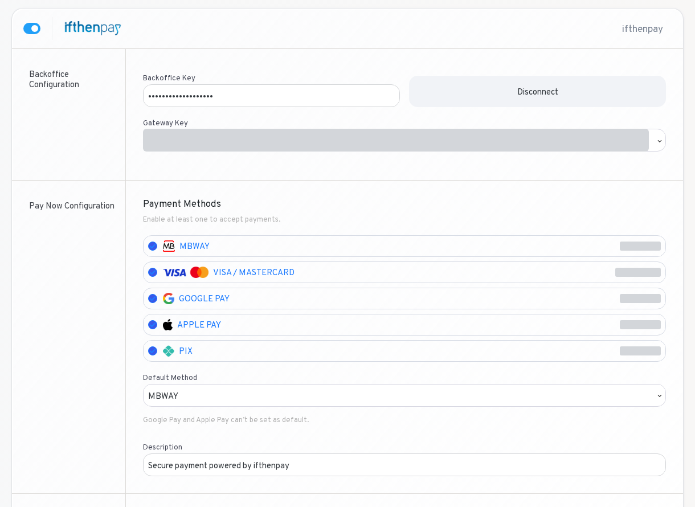

2. **(Admin Only) Pay Later Configuration — Multibanco and Payshop, each with their own Reference Validity and Minimum Lead Time.**  
   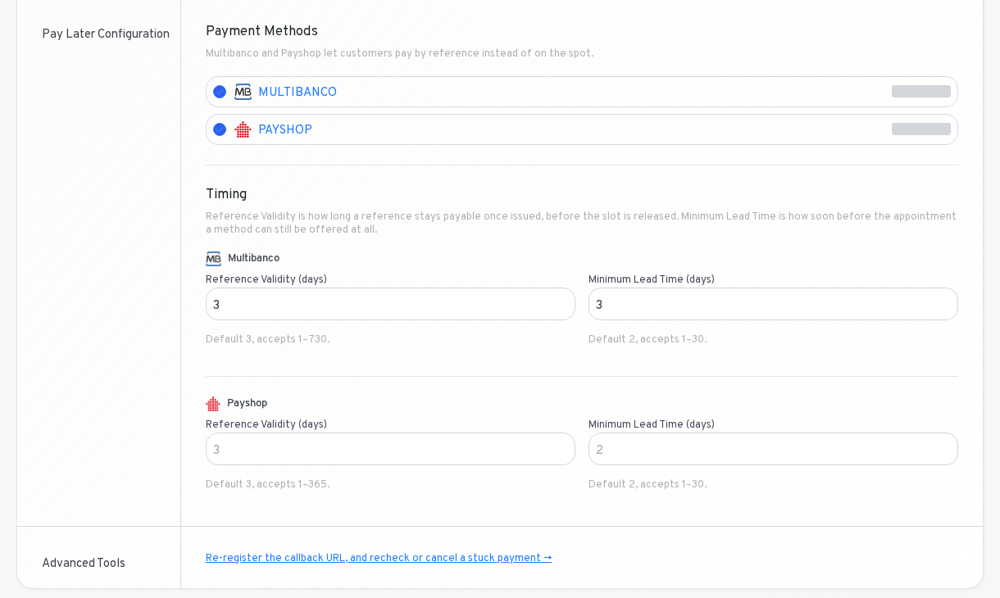

3. **(Admin Only) The ifthenpay Tools page — callback URL registration status, with one-click re-registration.**  
   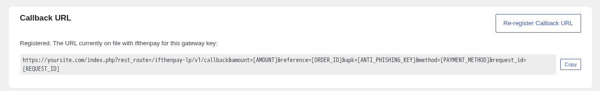

4. **(Admin Only) Outstanding Deferred Payments — recheck or cancel a stuck Multibanco/Payshop reference from wp-admin.**  
   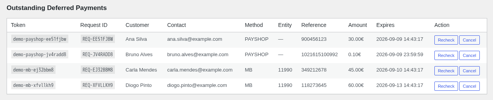

5. **(Admin Only) Unclaimed Realtime Payments — a payment confirmed by ifthenpay that never matched a completed booking.**  
   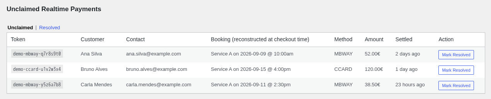

6. **(Admin Only) Resolved realtime payments, with an Unresolve action if marked by mistake.**  
   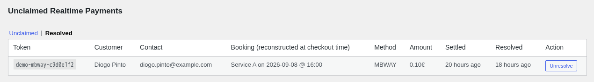

7. **(Customer Experience) Choosing when to pay: instantly (Pay Now) or by reference (Pay Later).**  
   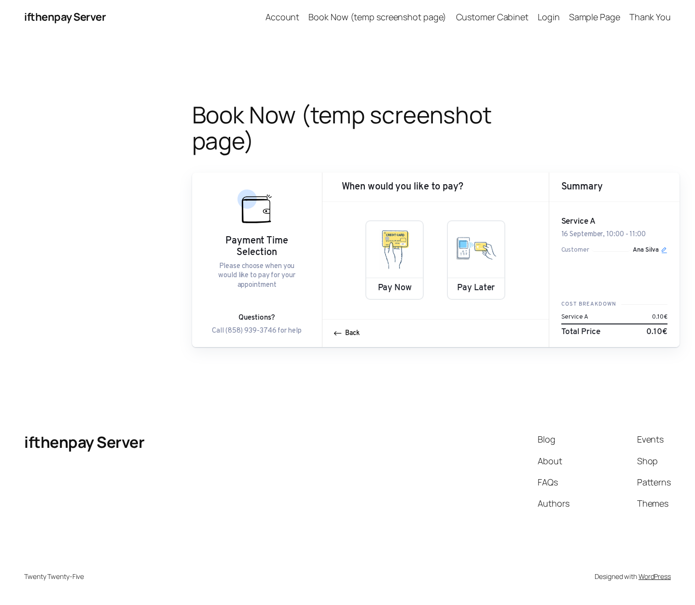

8. **(Customer Experience) Choosing a deferred method: Multibanco or Payshop.**  
   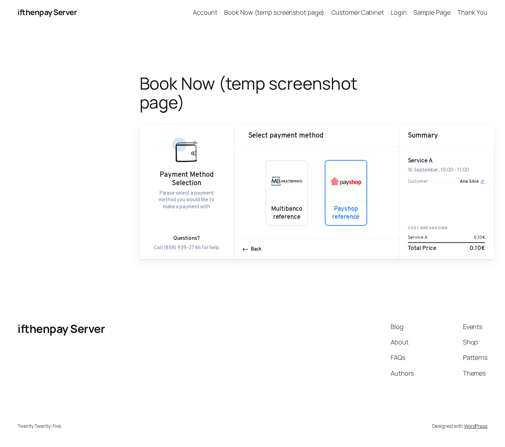

9. **(Customer Experience) Multibanco reference shown on the booking confirmation.**  
   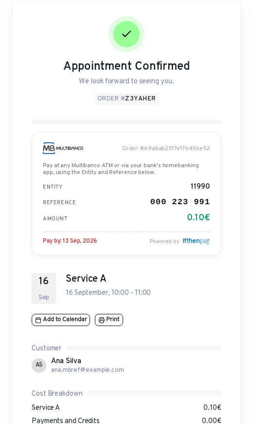

10. **(Customer Experience) The ifthenpay secure payment page for instant methods (MB WAY, cards, Pix).**  
    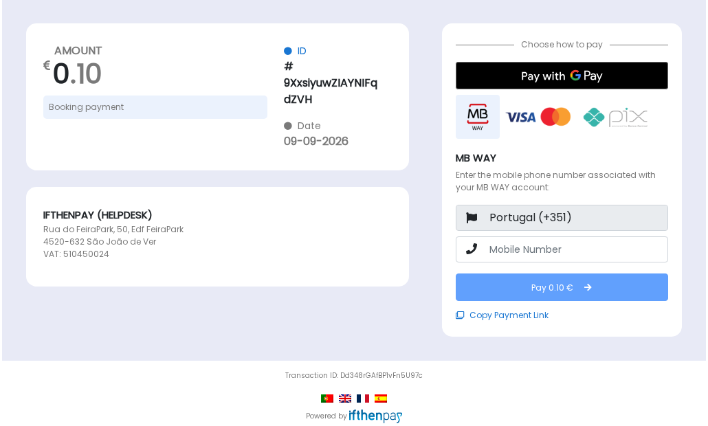

11. **(Customer Experience) The Multibanco reference is also available later in the customer's own dashboard.**  
    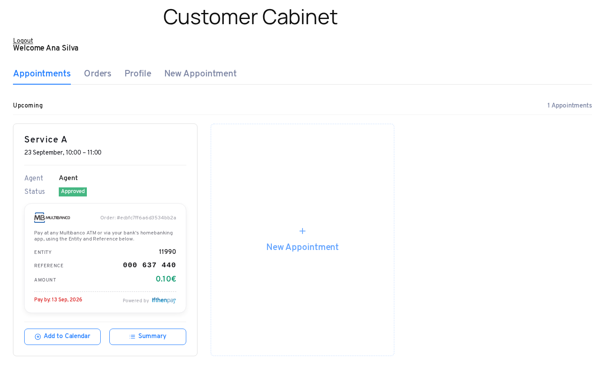

12. **(Customer Experience) The "Appointment Confirmation" email — LatePoint's own booking-created notification, with the Multibanco reference attached.**  
    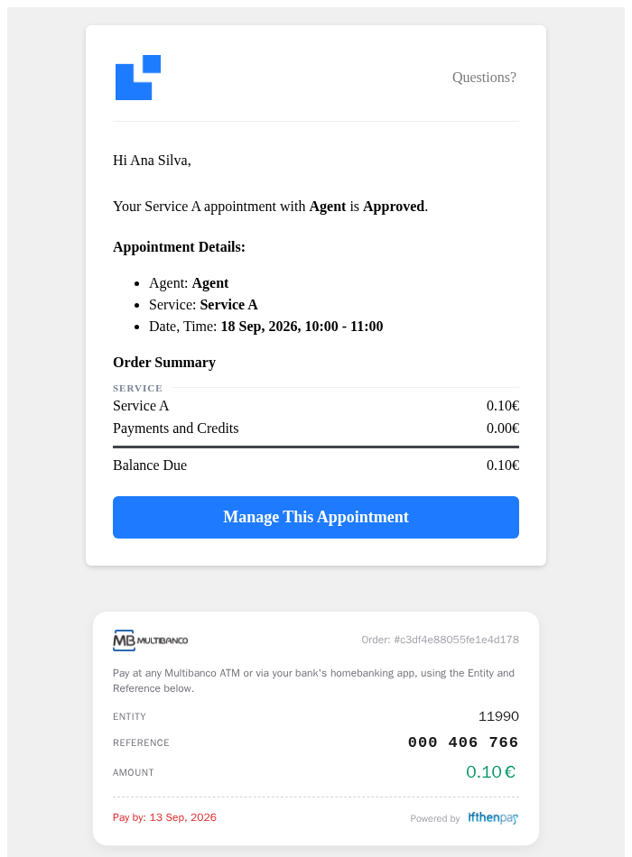

13. **(Customer Experience) The "Payment Received" email this plugin adds, sent once a payment actually settles.**  
    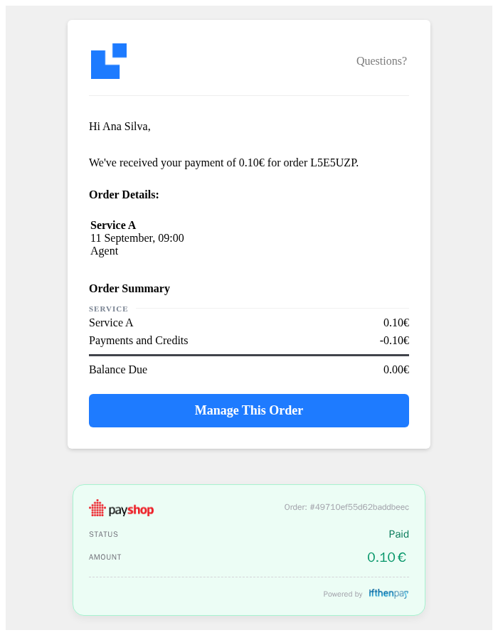

## Development

This plugin has **no `composer.json`, no `vendor/`, no PSR-4 autoload** — that's deliberate, not an
oversight. It follows the LatePoint addon-starter pattern: files load through explicit `include_once`
calls in `includes()`, hooked to `latepoint_includes`, with global prefixed class names under `lib/`.
Introducing Composer here would diverge from every other LatePoint addon.

Because of that, this plugin's PHP test tooling (PHPUnit, wp-phpunit, Brain Monkey) lives as dev
dependencies in the **dev-env repo root** (`/workspace/repo`), not in this folder. Run tests from
there:

```bash
cd /workspace/repo
composer test:unit   # tests/unit — no WordPress booted
composer test:int    # tests/integration — real wordpress_test DB
composer test        # both
```

## Support

For assistance use the [WordPress.org support forum](https://wordpress.org/support/plugin/ifthenpay-payments-for-latepoint/):

Include when opening a ticket:

- Backoffice account
- Site URL + plugin version
- Exact error message + log excerpts / screenshots

Pre-checks:

- Payment method enabled on Gateway Key AND mapped to Integration
- Running current recommended versions of WordPress, PHP & LatePoint

Commercial helpdesk available (no direct email required): [helpdesk.ifthenpay.com](https://helpdesk.ifthenpay.com/)

- **ifthenpay support**: [suporte@ifthenpay.com](mailto:suporte@ifthenpay.com)
- **LatePoint docs**: [LatePoint docs](https://wpdocs.latepoint.com/)
