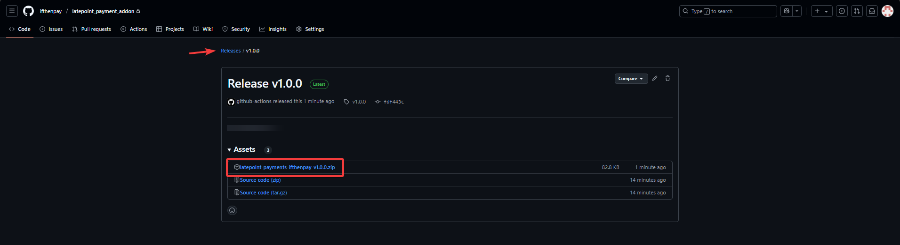
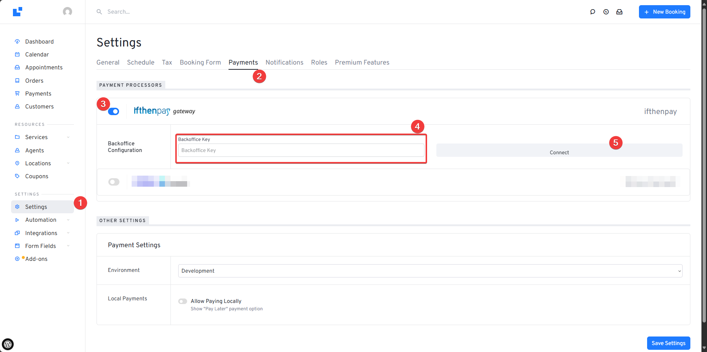
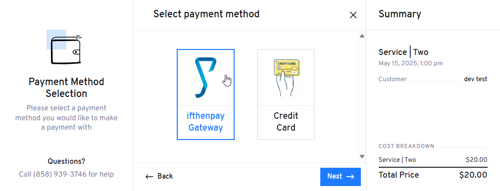
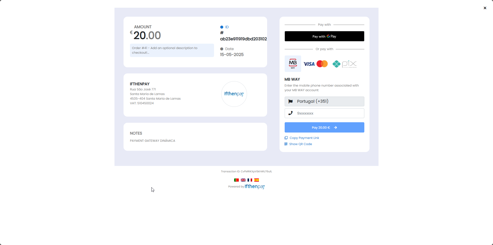

# **LatePoint - Gateway de Pagamentos ifthenpay**  
### 📘 Guia do Utilizador 

Leia em  [Português](README_PT.md) ou  [Inglês](README.md)

### 📌 Índice

1. [Introdução 🚀](#1-introdução-🚀)
2. [Requisitos 📋](#2-requisitos-📋)
3. [Instalação 📥](#3-instalação-📥)
4. [Configuração ⚙️](#4-configuração-⚙️)
5. [Experiência do Cliente 🧑‍💻](#5-experiência-do-cliente-🧑‍💻)
6. [Suporte de Idiomas 🌍](#6-suporte-de-idiomas-🌍)
7. [Suporte & Manutenção 🛠️](#7-suporte--manutenção-🛠️)

---

### 1. Introdução 🚀

A **ifthenpay** é uma fornecedora portuguesa de pagamentos digitais fundada em 2004, especializada em soluções de pagamento omnicanal. Integra-se facilmente com vários ERPs, plataformas de e-commerce e softwares de faturação, oferecendo às empresas uma abordagem abrangente para gerir transações financeiras online através de diversos métodos de pagamento.

O **LatePoint** é um sistema intuitivo e poderoso de agendamento de marcações para WordPress, permitindo às empresas gerir reservas de forma eficiente e proporcionar uma experiência de agendamento fluida aos clientes.

Este plugin integra de forma eficaz a gateway de pagamentos da ifthenpay no processo de checkout do LatePoint, permitindo pagamentos online seguros, fáceis e versáteis através de:

- **PIX** 🇧🇷: Método de pagamento brasileiro rápido, utilizando QR codes ou chaves Pix.
- **BIZUM** 📲: Pagamento móvel rápido, amplamente utilizado em Espanha.
- **MB WAY** 📱: Pagamentos instantâneos via smartphone, populares em Portugal.
- **Payshop** 💼: Vouchers de pagamento de valor fixo disponíveis em estabelecimentos portugueses.
- **Multibanco** 🏧: Pagamentos através da rede de caixas Multibanco usando referências.
- **Cartão de Crédito (Visa & MasterCard)** 💳: Pagamentos com cartão de crédito fiáveis e seguros.
- **Google Pay** 🌐: Transações fáceis através da carteira digital da Google.
- **Apple Pay** 🍎: Pagamentos seguros via dispositivos Apple.

Esta integração ajuda empresas que utilizam o LatePoint a aumentar a satisfação dos clientes, oferecendo soluções de pagamento confiáveis, eficientes e convenientes.

### 2. Requisitos 📋

Para utilizar o plugin da ifthenpay com sucesso, garanta que o seu ambiente cumpre estes requisitos:

- **WordPress:** Versão 6.5 ou superior.
- **Plugin LatePoint:** Instalado e ativo no seu site WordPress.
- **PHP:** Versão 7.4 ou superior.

Adicionalmente, para integrar e utilizar a gateway de pagamentos ifthenpay:

- É necessária uma conta **ifthenpay** ativa.
- Contacte o suporte da ifthenpay para solicitar a sua **Chave de Backoffice** e ativar as suas **Chaves de Gateway**.
- Após fornecer uma Chave de Backoffice válida nas definições do plugin, as Chaves de Gateway disponíveis serão carregadas automaticamente.

Para mais informações, visite o [site oficial da ifthenpay](https://www.ifthenpay.com).

### 3. Instalação 📥

Siga estes passos para instalar o plugin LatePoint ifthenpay Gateway de Pagamentos:

1. **Descarregar o Plugin**

   - [Descarregue](https://github.com/ifthenpay/latepoint-payment-addon/releases/download/v1.0.0/latepoint-payment-addon-v1.0.0.zip) a versão mais recente do plugin em formato `.zip` do repositório oficial.

2. **Carregar para o WordPress**

   - No painel de administração do WordPress, vá a **Plugins > Adicionar Novo**.
   - Clique em **Carregar Plugin**, selecione o ficheiro `.zip` descarregado e clique em **Instalar Agora**.

3. **Ativar o Plugin**

   - Após a instalação, clique em **Ativar Plugin**.

4. **Verificar Instalação do LatePoint**

   - Certifique-se de que o plugin LatePoint está instalado e ativo, pois esta gateway de pagamentos depende dele.

5. **Proceder à Configuração**
   - Após ativar, configure o plugin conforme descrito na secção seguinte.

O seu plugin está agora instalado e pronto para configuração.

### 4. Configuração ⚙️

Para configurar o Gateway de Pagamentos LatePoint ifthenpay:

1. Aceda ao painel do WordPress.
2. Navegue até **LatePoint > Definições > Pagamentos**.
3. No separador **Pagamentos**, ative o alternador **ifthenpay Gateway**, introduza a sua **Chave de Backoffice** fornecida pela ifthenpay e clique em **Sincronizar**.

4. Após validar a chave, o plugin irá buscar automaticamente as **Chaves de Gateway** disponíveis. Selecione a chave correspondente à conta desejada.
5. Selecione e configure os **Métodos de Pagamento** disponíveis. Para cada método, utilize a caixa de seleção para ativar ou desativar e selecione a conta de pagamento associada no menu suspenso.
6. Escolha um **Método de Pagamento Padrão** para agilizar o checkout do utilizador.
7. Opcionalmente, adicione uma **Descrição** personalizada para aparecer durante o checkout.

8. Guarde a sua configuração.

### 5. Experiência do Cliente 🧑‍💻

1. **Escolher Método de Pagamento**

   Durante a marcação, se os pagamentos estiverem ativos, os clientes escolhem um método de pagamento. Podem selecionar a **ifthenpay Gateway** e proceder ao pagamento seguro.

2. **Página de Pagamento Segura**

   São redirecionados para uma página segura da ifthenpay para pagar com o método preferido (ex: Google Pay, cartão de crédito).

3. **Confirmação & Retorno**

   Após concluir o pagamento, os clientes são devolvidos ao seu site. A marcação é confirmada e o estado do pagamento é refletido imediatamente no LatePoint.

### 6. Suporte de Idiomas 🌍

Este plugin suporta atualmente os seguintes idiomas:

- 🇵🇹 **Português (Portugal)** — `pt-PT`
- 🇪🇸 **Espanhol (Espanha)** — `es-ES`
- 🇬🇧 **Inglês (UK)** — `en-UK`
- 🇫🇷 **Francês (França)** — `fr-FR`

O plugin adapta automaticamente o texto e interface ao idioma configurado nas definições do WordPress, garantindo uma experiência fluida para administradores e clientes.

### 7. Suporte & Manutenção 🛠️

Se encontrar problemas ou precisar de assistência, consulte os seguintes recursos:

- 📖 [FAQ oficial da ifthenpay](https://helpdesk.ifthenpay.com/en/support/home)
- 📬 Email de Suporte: `suporte@ifthenpay.com`
- 🧰 [Base de Conhecimento LatePoint](https://wpdocs.latepoint.com/)

#### Manter o Plugin Atualizado:

- Utilize sempre as versões mais recentes do WordPress, LatePoint e deste plugin.
- Reveja o changelog antes de atualizar.
- Após atualizações, teste os fluxos de pagamento para garantir o funcionamento.

Atualizações regulares e monitorização ativa garantem compatibilidade contínua e desempenho ideal.
